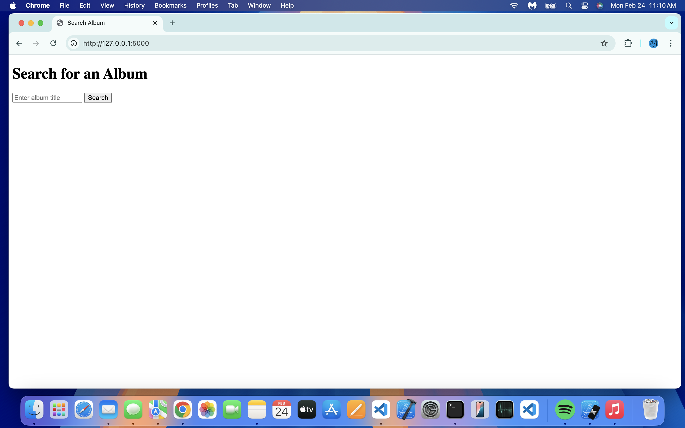
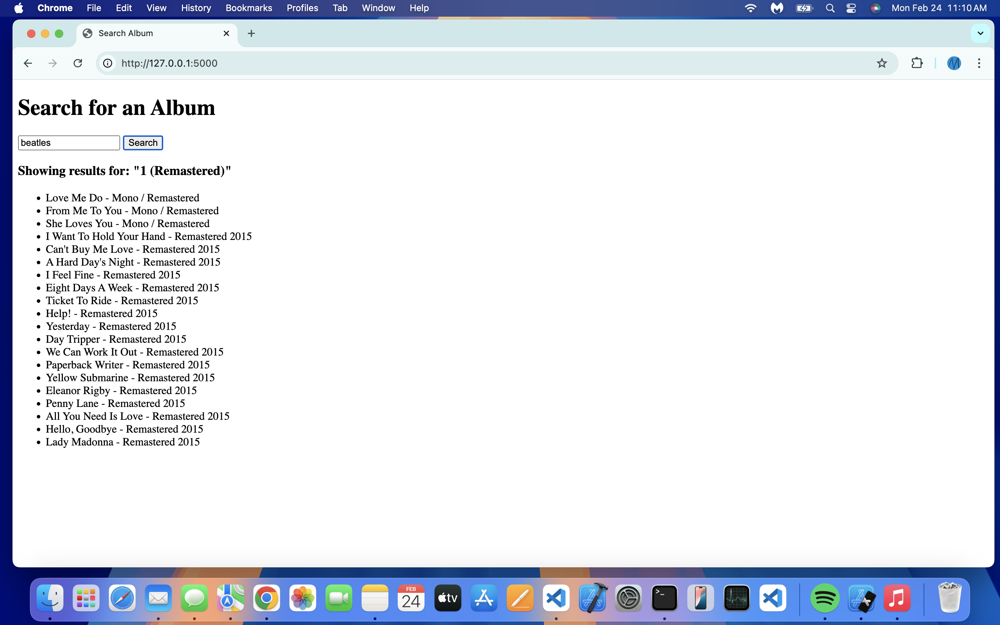

# Spotify Api Search
This is a simple music search program that utilizes the Spotify Api.

## Technologies Used
- Python
- Flask
- Vanilla HTML, CSS, and JavaScript
- Spotify API

## How This was made

You can find the instructions for how I made this [here](FILL THIS IN).

Clone this repo then create a .env file.
```
git clone https://github.com/MichaelT-W23/spotify-api-search.git
```

Paste your credentials in the .env file 
```
SPOTIFY_CLIENT_ID=YOUR_SPOTIFY_CLIENT_ID
SPOTIFY_CLIENT_SECRET=YOUR_SPOTIFY_CLIENT_SECRET
```

Run your app using the following commands
```
cd spotify-api-search
pip3 install -r requirements.txt
python3 app.py
```

Paste the link it's running on in your browser
```
http://127.0.0.1:5000
```

## This is what the UI looks like


<br>

